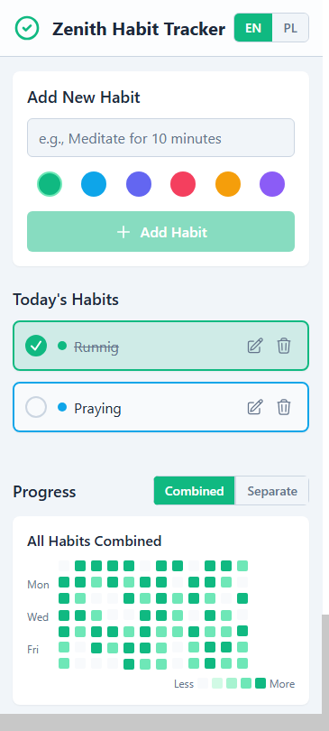

# 🎯 Habit Tracker

A simple habit tracking application built with React Native and Expo. Track your daily habits, visualize your progress, and build better routines.


## ✨ Features

### Core Functionality
- ✅ **Habit Management** - Create, edit, and delete habits
- 🎨 **Color Coding** - Choose from 6 colors to categorize habits
- 📅 **Daily Tracking** - Mark habits as complete/incomplete each day
- 📊 **Progress Visualization** - GitHub-style contribution calendar
- 🌍 **Multilingual Support** - English and Polish languages
- 🌓 **Dark Mode** - Full dark/light theme support
- 💾 **Persistent Storage** - All data saved locally

### Visualization Modes
- **Combined View** - See all habits together in one calendar
- **Separate View** - Individual calendars for each habit
- **12-Week History** - Track your progress over time

### User Experience
- 🎯 Intuitive interface
- ⚡ Fast and responsive
- 📱 Mobile-optimized
- 🎭 Smooth animations
- ♿ Accessibility support

## 📸 Screenshots

```

```

## 🚀 Getting Started

### Prerequisites

- Node.js (v18 or higher)
- npm or yarn
- Expo CLI
- iOS Simulator (for iOS development) or Android Studio (for Android development)

### Installation

1. **Clone the repository**
   ```bash
   git clone https://github.com/yourusername/zenith-habit-tracker.git
   cd zenith-habit-tracker
   ```

2. **Install dependencies**
   ```bash
   npm install
   # or
   yarn install
   ```

3. **Install required packages**
   ```bash
   npx expo install react-native-svg
   npx expo install react-native-safe-area-context
   npx expo install @react-native-async-storage/async-storage
   ```

4. **Start the development server**
   ```bash
   npx expo start
   ```

5. **Run on your device**
    - Press `i` for iOS simulator
    - Press `a` for Android emulator
    - Scan QR code with Expo Go app for physical device

## 📁 Project Structure

```
zenith-habit-tracker/
├── app/
│   ├── _layout.tsx          # Root layout with providers
│   └── index.tsx            # Main home screen
├── components/
│   ├── AddHabitForm.tsx     # Form to add new habits
│   ├── EditHabitModal.tsx   # Modal for editing habits
│   ├── HabitItem.tsx        # Individual habit component
│   ├── HabitList.tsx        # List of today's habits
│   ├── Header.tsx           # App header with language switcher
│   ├── Icons.tsx            # SVG icon components
│   ├── LanguageSwitcher.tsx # Language selection component
│   └── ProgressCalendar.tsx # Calendar visualization
├── constants/
│   └── Colors.ts            # Color scheme definitions
├── hooks/
│   └── useLocalStorage.ts   # Custom hook for storage
├── i18n/
│   ├── translations.ts      # Translation strings (EN/PL)
│   └── LanguageContext.tsx  # Language context provider
├── types/
│   └── index.ts             # TypeScript type definitions
├── utils/
│   ├── date.ts              # Date utility functions
│   └── generateId.ts        # ID generation utility
├── app.json                 # Expo configuration
├── package.json             # Dependencies
└── README.md               # This file
```


## 🌍 Internationalization

The app supports multiple languages out of the box:

- 🇬🇧 **English** (Default)
- 🇵🇱 **Polish**

### Adding a New Language

1. Update `i18n/translations.ts`:
   ```typescript
   export type Language = 'en' | 'pl' | 'your-lang';
   ```

2. Add translations:
   ```typescript
   export const translations: Record<Language, Translations> = {
     en: { /* ... */ },
     pl: { /* ... */ },
     'your-lang': {
       appTitle: 'Your Translation',
       // ... all other keys
     },
   };
   ```

3. Update `LanguageSwitcher.tsx` to include the new language option.

## 💾 Data Storage

The app uses AsyncStorage for local data persistence:

- **Habits** - Stored under `@zenith_habits`
- **Completions** - Stored under `@zenith_completions`
- **Language** - Stored under `@zenith_language`

All data is stored locally on the device and persists across app restarts.

## 🎯 Usage

### Adding a Habit
1. Enter habit name in the input field
2. Select a color
3. Tap "Add Habit" button

### Completing a Habit
- Tap the checkbox next to any habit to mark it complete/incomplete

### Editing a Habit
1. Tap the pencil icon on any habit
2. Modify the name or color
3. Tap "Save Changes"

### Deleting a Habit
- Tap the trash icon on any habit to delete it

### Viewing Progress
- Scroll down to see your progress calendar
- Toggle between "Combined" and "Separate" views
- Each cell represents one day
- Color intensity shows completion rate

## 🛠️ Built With

- **[React Native](https://reactnative.dev/)** - Mobile framework
- **[Expo](https://expo.dev/)** - Development platform
- **[TypeScript](https://www.typescriptlang.org/)** - Type safety
- **[React Native SVG](https://github.com/software-mansion/react-native-svg)** - SVG rendering
- **[AsyncStorage](https://react-native-async-storage.github.io/async-storage/)** - Local storage
- **[Expo Router](https://docs.expo.dev/router/introduction/)** - Navigation

## 📱 Supported Platforms

- ✅ iOS (iPhone & iPad)
- ✅ Android
- ❌ Web (not optimized)

## 🎨 Customization

### Changing Colors

Edit `constants/Colors.ts` to customize the color scheme:

```typescript
export const Colors = {
  emerald: '#10b981',
  // ... add your colors
};
```

### Modifying Themes

The app automatically adapts to system dark/light mode. Customize theme colors in `constants/Colors.ts`:

```typescript
export const Colors = {
  light: {
    background: '#f9fafb',
    text: '#111827',
    // ...
  },
  dark: {
    background: '#111827',
    text: '#f9fafb',
    // ...
  },
};
```

## 🧪 Testing

```bash
# Run tests (if configured)
npm test

# Type checking
npm run type-check

# Linting
npm run lint
```

## 📦 Building for Production

### iOS
```bash
eas build --platform ios
```

### Android
```bash
eas build --platform android
```

### Both Platforms
```bash
eas build --platform all
```

## 🐛 Bug Reports

Found a bug? Please open an issue with:
- Description of the bug
- Steps to reproduce
- Expected behavior
- Screenshots (if applicable)
- Device/OS information

## 📝 License

This project is licensed under the MIT License - see the [LICENSE](LICENSE.md) file for details.

## 👨‍💻 Author

**Your Name**
- GitHub: [@rafalwizen](https://github.com/rafalwizen)
- Email: [rafal.wizen@gmail.com](mailto:rafal.wizen@gmail.com)

## 🙏 Acknowledgments

- Icons designed using Heroicons
- Inspired by GitHub's contribution calendar
- Built with ❤️ by a world-class React engineer

## 📈 Roadmap

### Upcoming Features
- [ ] Weekly/Monthly statistics
- [ ] Habit streaks and achievements
- [ ] Reminders and notifications
- [ ] Data export/import
- [ ] Cloud sync
- [ ] More languages
- [ ] Custom habit categories
- [ ] Social sharing
- [ ] Widgets

## 💡 Tips & Best Practices

### For Best Results
1. **Be Consistent** - Check in daily to track your habits
2. **Start Small** - Begin with 2-3 habits before adding more
3. **Choose Meaningful Colors** - Use colors to categorize related habits
4. **Review Progress** - Check your calendar weekly to stay motivated

### Performance
- The app loads instantly with local storage
- No internet connection required
- Smooth animations at 60fps
- Optimized for battery life

## 🔒 Privacy

- ✅ All data stored locally on your device
- ✅ No analytics or tracking
- ✅ No account required
- ✅ No data sent to external servers
- ✅ Complete privacy and control

## 📞 Support

Need help? Have questions?

- 📧 Email: rafal.wizen@gmail.com

## ⭐ Star History

If you find this project helpful, please consider giving it a star! ⭐

---

**Made with 💚 using React Native & Expo**